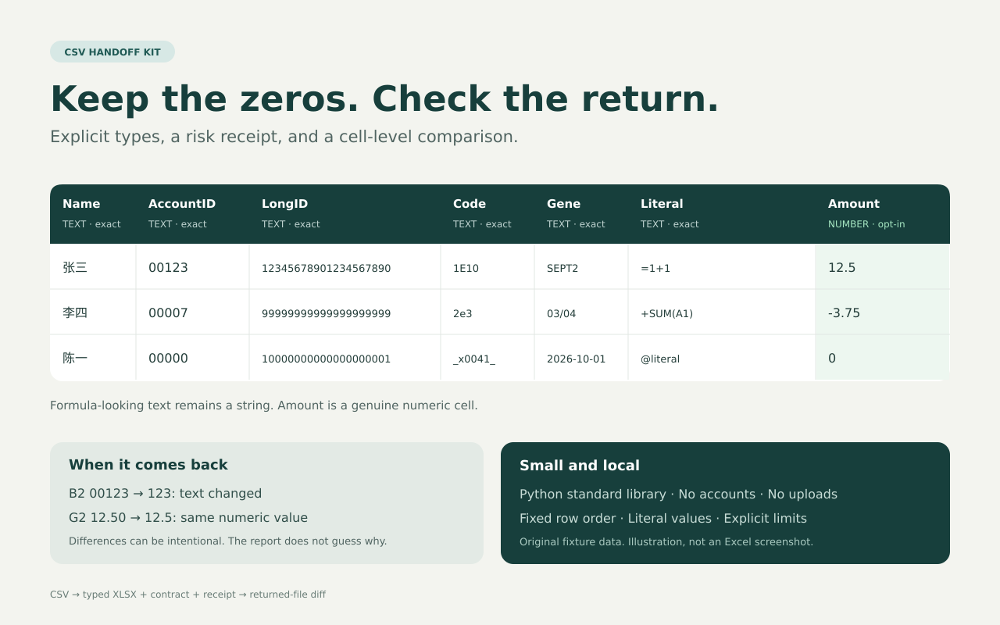

# csv-handoff-kit

**A column contract before the handoff. A cell-level diff when it comes back.**

A small local experiment for sharing a CSV as an XLSX without guessing which identifiers are numbers. All columns default to literal text; only explicitly named columns become numeric. Keep the baseline contract, then check the returned CSV or XLSX in fixed row order.

Python 3.10+ · standard library only · MIT · no account, network calls, telemetry, or uploads



## Try the fictional example

From this repository, choose output directories that do not already contain output files:

```sh
python scripts/csv_handoff.py pack examples/source.csv \
  --delimiter ',' --number Amount --output-dir handoff
python scripts/csv_handoff.py verify handoff/handoff.xlsx \
  --contract handoff/contract.json --output-dir check
```

Use another quote convention with `--quotechar`; quotes inside a quoted field are doubled. Delimiters are never inferred. Omit `--number Amount` to keep **every** column as text. Repeat `--number 'Exact header name'` to explicitly select more numeric columns. No column names are guessed.

The example has Chinese names, `00123`, a 20-digit ID, `1E10`, `SEPT2`, literal `=1+1`, and numeric Amount values. All examples are invented; they are not real customer or billing records.

The bundle contains:

- `handoff.xlsx`: one `Data` sheet; text cells use actual string storage and Text format, not a leading apostrophe; selected numeric cells use numeric storage
- `contract.json`: column types, original field values, fixed-row-order baseline, dialect, and SHA-256 references
- `risks.json`: per-cell, informational flags for leading zeros, long integers, scientific/date/formula-looking strings, whitespace, Unicode, and OOXML-escape-looking text
- `receipt.txt`: readable column choices and handoff instructions

**Privacy:** the contract, risks, and diff files include original or returned cell values. Treat them as sensitive when working with sensitive sources. Everything stays local; sharing a file is a separate action. The contract must remain trusted and unchanged. Hashes identify files; they are not signatures, encryption, or tamper-proof evidence.

## Check a returned file

```sh
python scripts/csv_handoff.py verify examples/returned-edited.csv \
  --contract examples/prepared/contract.json --output-dir returned-check
```

A returned `.csv` uses the original UTF-8 encoding/dialect contract. A returned `.xlsx` must contain exactly one worksheet named `Data`. Output: `diff.json` plus a concise `diff.txt`. The complete JSON includes every observation; the text preview shows at most 200 observations with bounded cell previews.

| Exit | Meaning |
| --- | --- |
| 0 | Unchanged under the comparison contract |
| 1 | Differences found; they may be intentional edits |
| 2 | Invalid, unsafe, unsupported, or over-limit input; comparison did not complete |

Text is compared by exact decoded field value. XLSX storage types are checked too. Numbers compare by decimal value: CSV `12.50` → `12.5` is a separate **representation change, values equal**, whereas `12.50` → `20.25` is a value change. Missing/empty spreadsheet cells are equivalent to empty fields; an empty numeric field remains empty, never zero. Sorting, deleting, or inserting rows yields positional differences. Formatting is not compared.

**Returned formulas are rejected**, including ordinary added `SUM` formulas and formulas with cached results. Return a separate literal-values-only copy. Macros, external relationships, embeddings, defined names, merged cells, and unsupported package parts are also rejected. This is deliberately narrower than a general spreadsheet reader.

## Numeric contract

Only plain decimal syntax is accepted: `12.50`, `-3.75`, `0`. Empty values are allowed. No currency symbols, grouping, percentages, exponents, surrounding whitespace, leading `+`, ambiguous leading zeros, or negative zero. Reject values with more than 15 significant digits (including trailing zeros after the first nonzero), values outside the supported finite range, or failure to round-trip at 15 decimal digits. Numeric source spelling and trailing zeros are not preserved as workbook formatting.

This is a conservative decimal round-trip rule, not arbitrary-precision spreadsheet arithmetic. Decimal fractions can still have binary floating-point approximations inside spreadsheet applications. Use text for values requiring exact digit strings or greater precision. The CLI refuses risky coercions; it never claims to repair digits already lost upstream.

## Scope and limits

- UTF-8 CSV, optional initial BOM; unique nonempty headers; rectangular rows; explicit printable one-character delimiter and quote character
- 10 MiB input file; 10,000 total rows including header; 256 columns; 250,000 cells; 32,767 UTF-16 code units per field
- XLSX: at most 128 ZIP entries, 20 MiB per expanded part, 40 MiB total expansion, ratio at most 1,000; at most 1,000,000 XML nodes per part and depth 64; UTF-8 OOXML only. An otherwise in-limit CSV is rejected if generated OOXML exceeds these budgets; split the source
- No DTD/entity declarations, formulas, active content, network access, or execution of input; bounded ZIP reads without extracting paths
- Ordinary shared strings and rich-text runs can be read; phonetic annotations are ignored; ambiguous duplicate/mixed strings and unsupported escape/control sequences are rejected. This is a bounded supported-subset verifier, not a complete OOXML conformance validator
- Reader interoperability edge: openpyxl 3.1.5 exposes the raw escape prefix for inline literals such as `_x0041_`; the tool and the tested LibreOfficeDev build decode them correctly. See the validation record before using this with another reader
- The risk labels are heuristics and are not a complete detector of application behavior
- Exactness covers decoded field values, not original CSV bytes, quote choices, row terminators, formatting, authorship, or editing intent
- Raw CSV reopened in spreadsheet software can still be coerced or interpreted as formulas. The generated, explicitly typed XLSX is the supported handoff
- XLSX structure and independent openpyxl 3.1.5 readback of the main ID/formula/numeric fixtures are tested. One **LibreOfficeDev 26.8.0.0.alpha0** headless XLSX save preserved the standard fixture; a separate CR→LF normalization was detected. **Microsoft Excel and stable LibreOffice releases have not been tested**

## Use as a skill

Point an agent at [`SKILL.md`](SKILL.md) and this repository directory. It resolves the script relative to the skill and runs locally. No global installation is needed. The skill requires an explicit numeric-column choice, preserves the all-text default, and distinguishes rejection from a completed return check.

## Why this experiment?

Real export workflows describe these hazards: [Expensify documents scientific notation and lost leading zeros](https://github.com/Expensify/App/blob/main/docs/articles/new-expensify/reports-and-expenses/How-to-Export-Expenses.md); [AWS's billing-adjustment sample warns about spreadsheet-mangled IDs](https://github.com/aws-samples/aws-marketplace-reference-code/blob/main/applications/billing-adjustments/README.md); [Microsoft explains automatic conversions and its 15-digit numeric precision limit](https://support.microsoft.com/en-us/excel/keeping-leading-zeros-and-large-numbers).

Conversion itself is established. [FileGizmo](https://filegizmo.com/csv/csv-to-excel/), [Looty](https://lootytools.com/guides/preserve-leading-zeros-csv-to-excel), and [csv-data-tools](https://github.com/lyrasis/csv-data-tools/) are existing alternatives. This experiment focuses on the **explicit column contract + per-cell risk receipt + returned-file diff** workflow. Demand for that combination is a hypothesis, not demonstrated adoption or a claim of unique conversion technology.

## Tests and license

```sh
python -m unittest discover -s tests -v
# Optional independent-reader test dependency in an isolated environment:
python -m venv .venv
.venv/bin/python -m pip install -r requirements-dev.txt
.venv/bin/python -m unittest discover -s tests -v
```

Without openpyxl, the independent-reader test is visibly skipped; the stdlib tests still run. Test coverage and known limits are recorded in [`docs/validation.md`](docs/validation.md). Code, skill text, fixtures, workbook template, and illustrated preview were written for this project and are under [MIT](LICENSE). Development, documentation, and validation were AI-assisted; the test record states what was actually checked and does not imply manual authoring or comprehensive application compatibility. No vendor documentation or third-party templates are bundled. Python is provided separately under its own license; optional test dependencies keep their upstream licenses (openpyxl: MIT; et-xmlfile: MIT).

---

## 中文说明

**先约定列类型，再交接；文件返回后，逐单元格比较。**

这是一个本地运行的小型实验，不需要账号、联网或全局安装。默认把所有列写成真正的文本单元格；只有通过 `--number Amount` 明确指定的列才转成数字。中文、前导零、20 位编号、`1E10`、`SEPT2` 和 `=1+1` 都可保留为文本。它不是通用表格编辑器，也不能恢复已经丢失的数字。

- 按上面的示例运行 `pack`，生成工作簿、列约定、逐单元格风险提示和可读回执
- 保留原始 `contract.json`，收到文件后运行 `verify`。按原行序比较，不自动匹配或重排记录
- 退出码 `0` 表示约定范围内一致，`1` 表示有差异，`2` 表示拒绝或未完成检查。差异也可能是有意修改，不应一概称为损坏
- 数字 `12.50` 变成 `12.5` 会标明“表示方式变化、数值相等”。文本列按实际字符比较
- 返回的 XLSX 必须只有名为 `Data` 的工作表且没有公式；新增 `SUM` 也会被拒绝，不能用缓存结果代替验证
- 约定、风险报告和差异文件含原始数据，真实业务使用时应按敏感文件保管。本工具不自动上传，也不收集遥测
- 支持明确分隔符的 UTF-8 CSV，最多 10 MiB、10,000 行、256 列、250,000 个单元格；完整边界见英文说明
- 生成的 XLSX 使用明确的字符串类型。直接把 CSV 再次交给表格软件打开，仍可能发生类型或公式推断
- 已验证 OOXML、独立读取器和一次 LibreOfficeDev 26.8.0.0.alpha0 回存；另一个例子中的回车变换被正确报告。Microsoft Excel 和稳定版 LibreOffice 尚未测试
